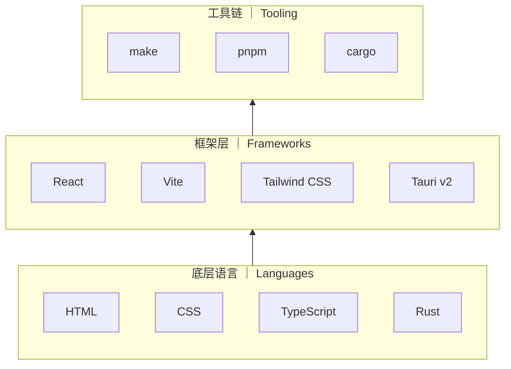

# Contributing

感谢你对 Whale Play 的关注！这份指南会帮你了解如何参与贡献。

## 行为准则

- 保持友善和尊重
- 接受建设性批评
- 聚焦在对社区最有利的方向

## 如何贡献

### 报告 Bug

1. 在 [Issues](https://github.com/YELEBAI/WhalePlay/issues) 中搜索是否已有人报告
2. 如果没有，使用 **Bug 反馈** 模板新建 Issue
3. 尽量提供：版本号、平台、复现步骤、截图/日志

### 功能建议

1. 先在 [Discussions](https://github.com/YELEBAI/WhalePlay/discussions) 的 Ideas 分类中讨论
2. 讨论成熟后，用 **功能建议** 模板新建 Issue

### 提交代码

1. Fork 仓库并创建分支：`git checkout -b feature/my-feature`
2. 确保代码通过检查：
   ```bash
   pnpm lint
   pnpm --filter @neo-tavern/desktop exec tsc --noEmit
   ```
3. 提交时使用清晰的 commit message（中文或英文均可）
4. Push 并[创建 Pull Request](https://github.com/YELEBAI/WhalePlay/compare)

### PR 规范

- 一个 PR 只做一件事
- PR 标题简洁描述变更内容
- 描述中说明动机和实现思路
- 修复问题时关联相关 Issue（`Closes #123`）

## 项目架构

Whale Play 的技术栈分为三个层级：



- **底层语言**：HTML/CSS 负责界面，TypeScript 负责逻辑，Rust 负责 Tauri 的桌面桥接。
- **框架层**：React 构建 UI，Vite 做打包和 HMR，Tauri 将 Web 应用包装为原生窗口。
- **工具链**：pnpm 管理 JS 依赖和 workspace，cargo 管理 Rust 依赖和构建，make 作为便捷入口。

> 详细的架构说明见 `docs/zh/developer/architecture.md`。

## 开发环境

### 前置要求

| 工具          | 是否必须 | 说明                                                 |
| ------------- | -------- | ---------------------------------------------------- |
| Node.js >= 24 | ✅ 必须  | 与根目录 `package.json` 的 `engines.node` 保持一致   |
| pnpm          | ✅ 必须  |                                                      |
| Rust stable   | ⚠️ 可选  | 仅在需要 Tauri 桌面开发/打包时需要                   |
| make          | ⚠️ 可选  | 便捷命令入口，Windows 可通过 coreutils 或 MinGW 使用 |


### 常用命令

**pnpm（项目根目录）：**

```bash
pnpm dev              # 浏览器预览前端
pnpm tauri dev        # Tauri 桌面开发模式（需 Rust）
pnpm build            # 构建前端
pnpm build:desktop    # 打包桌面安装包
pnpm test             # 运行测试
```

**make（项目根目录，可选替代）：**

```bash
make          # 构建前端
make deps     # 安装 JS + Rust 依赖
make dev      # 启动开发服务器
make install  # 打包桌面安装包
make clean    # 清理构建产物和依赖
```

> 完整开发指南见 `docs/zh/developer/building.md`。

### 项目结构

```
apps/desktop/     # Tauri + React 桌面应用
packages/
  core/           # 提示词构建、模型 provider、世界书引擎
  shared/         # 共享类型与工具
  ui/             # 共享 UI 组件
docs/             # 文档（zh/en 双语）
```

## 代码风格

- TypeScript strict mode
- React 函数组件 + Hooks
- Zustand 状态管理
- Tailwind CSS 样式（优先用 `@layer components` 工具类）

## 文档

项目文档位于 `docs/` 目录，中英文各一份。贡献文档时请同步更新双语版本。

## 许可证

贡献即表示你同意将代码以 [MIT License](LICENSE) 授权。
