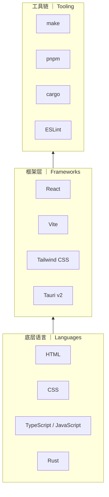

# Contributing

感谢你对 Whale Play 的关注！这份指南会帮你了解如何参与贡献。

## 行为准则

- 保持友善和尊重
- 接受建设性批评
- 聚焦在对社区最有利的方向

## 如何贡献

### 报告 Bug

1. 在 [Issues](https://github.com/YELEBAI/WhalePlay/issues) 中搜索是否已有人报告
2. 如果没有，使用 **Bug 反馈** 模板新建 Issue
3. 尽量提供：版本号、平台、复现步骤、截图/日志

### 功能建议

1. 先在 [Discussions](https://github.com/YELEBAI/WhalePlay/discussions) 的 Ideas 分类中讨论
2. 讨论成熟后，用 **功能建议** 模板新建 Issue

### 提交代码

1. Fork 仓库并创建分支：`git checkout -b feature/my-feature`
2. 确保代码通过检查：
   ```bash
   pnpm lint     # ESLint + TypeScript
   pnpm build    # tsc -b && vite build
   ```
3. 提交时使用清晰的 commit message（中文或英文均可）
4. Push 并[创建 Pull Request](https://github.com/YELEBAI/WhalePlay/compare)

### PR 规范

- 一个 PR 只做一件事
- PR 标题简洁描述变更内容
- 描述中说明动机和实现思路
- 关联相关 Issue（`Closes #123`）

## 开发环境

```bash
# 要求
Node.js >= 22
pnpm >= 11

# 安装
pnpm install

# Web 开发模式
pnpm dev

# Tauri 桌面开发模式（需 Rust）
pnpm --filter @neo-tavern/desktop tauri dev

# 检查
pnpm lint
# 检查构建和效果
pnpm build
pnpm build:desktop
```

## 项目架构

Whale Play 的技术栈分为三个层级，从底层向上层层依赖：



- **底层语言**：HTML/CSS 负责界面，TypeScript 负责逻辑，Rust 负责 Tauri 的桌面桥接和文件访问。
- **框架层**：React 构建 UI，Vite 做打包和 HMR，Tauri 将 Web 应用包装为原生窗口，其余库（Zustand、react-i18next 等）解决具体问题。
- **工具链**：pnpm 管理 JS 依赖和 workspace，cargo 管理 Rust 依赖和构建，make 作为统一入口脚本，ESLint 和 Vitest 做检查与测试。

## 项目结构

```
apps/desktop/     # Tauri + React 桌面应用
packages/
  core/           # 提示词构建、模型 provider、世界书
  shared/         # 共享类型与工具
  ui/             # 共享 UI 组件
```

## 代码风格

- TypeScript strict mode
- React 函数组件 + Hooks
- Zustand 状态管理
- Tailwind CSS 样式（优先用 `@layer components` 工具类）
- 组件文件：同目录 `types.ts` + `utils.tsx` 放类型和工具函数

## 许可证

贡献即表示你同意将代码以 [MIT License](LICENSE) 授权。
