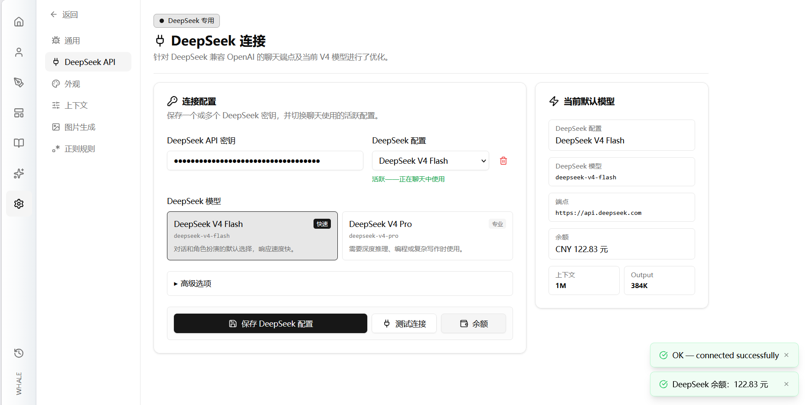

# 快速开始

本教程将带你从全新安装到完成第一次 AI 角色扮演聊天。你不需要任何技术背景——只需按照以下步骤操作即可。

---

## 第 1 步：启动应用

完成[安装](./installation.md)后，启动 Whale Play：

```bash
pnpm dev
```

开发服务器就绪后，终端会显示一个 URL——**在浏览器中打开它**：

```
➜  Local:   http://localhost:1420/
```

点击链接或将 `http://localhost:1420` 粘贴到浏览器地址栏中。你应该会看到 Whale Play 的主屏幕。

> **如果你使用的是预构建安装包：** 只需双击桌面或开始菜单中的 Whale Play 图标即可。应用程序会以普通窗口打开，无需使用终端。

---

## 第 2 步：配置 API Key

Whale Play 使用 DeepSeek API 来驱动 AI 回复。你需要添加自己的 API Key。

### 获取 DeepSeek API Key

1. 前往 [platform.deepseek.com](https://platform.deepseek.com/) 注册或登录。
2. 进入 **API Keys** 部分。
3. 点击 **Create new API key**，为其命名（例如 "Whale Play"），然后复制该 Key。

### 将 Key 添加到 Whale Play

1. 在应用中，找到**左侧边栏**——点击**齿轮图标** ⚙️（设置）。
2. 将你的 API Key **粘贴**到文本框中。
3. 点击 **"保存当前配置"**——你应该会看到一条成功消息。
4. 点击 **"测试连接"** 验证一切是否正常。右下角出现绿色弹窗即代表成功。



---

## 第 3 步：创建角色

现在来创建你的第一个角色——AI 将扮演这个角色。

1. 在**左侧边栏**中，点击**人物图标** 👤（角色）。
2. 你会看到一个空白的角色列表。点击 **"New Character"**。
3. 填写角色详细信息：

   | 字段              | 填写内容             | 示例                                                             |
   | ----------------- | -------------------- | ---------------------------------------------------------------- |
   | **Name**          | 角色名称             | 露娜                                                             |
   | **Description**   | 简短介绍             | 一位守护古老图书馆的神秘森林精灵                                 |
   | **Personality**   | 关键特质（逗号分隔） | 智慧、好奇、温柔、俏皮                                           |
   | **First Message** | 角色说的开场白       | _"欢迎你，旅人。我已等候多时。这些书几天来一直在低语你的名字。"_ |

4. 点击表单底部的 **"Create"**。

你的角色现在出现在列表中。你可以创建任意数量的角色——每个角色都有独特的个性。


> **📸 需要截图：** 用示例数据（如上方的"露娜"）填写创建角色表单，截取该对话框。图片保存为 `docs/images/character-create.png`。

---

## 第 4 步：开始聊天

角色已准备好，让我们来和他们对话吧。

1. 在**左侧边栏**中，点击**房屋图标** 🏠（主页）。
2. 你应该能在主屏幕上看到新角色的**头像卡片**。
3. **点击头像**或角色名称——这会打开聊天视图。
4. 在底部的文本框中输入消息，然后按 **Enter**（或点击发送按钮）。

AI 将根据你创建的角色卡片进行回复。每一条回复都会体现你赋予角色的性格、语气和背景故事。


> **📸 需要截图：** 向你的角色发送一条问候（例如 _"你好！这是什么地方？"_），截取显示你消息和 AI 回复的聊天视图。图片保存为 `docs/images/chat-first-message.png`。

---

## 第 5 步：探索更多

你已经成功运行起来了！以下是一些可以尝试的功能：

### 聊天操作

- **右键点击**（手机上长按）聊天消息可查看选项：
  - **Savepoint（存档点）**——标记对话中的某个时刻，以便后续返回。
  - **Delete（删除）**——移除消息或修剪聊天历史。
  - **Copy（复制）**——将消息复制到剪贴板。

### 更多角色

- 创建不同性格的角色，看看 AI 如何适应。
- 尝试编写更长或更详细的角色卡片，以获得更丰富的回复。

### 设置

- 在设置中调整 **Temperature** 和 **Max Tokens**，控制 AI 的创意性或专注度。
- 较低 Temperature（0.3–0.5）= 更可预测的回复。
- 较高 Temperature（0.8–1.2）= 更具创意、更出人意料的回复。
  > 但是思考模式下`Temperature`参数不会生效。

### 下一步

- 查阅本文档中的其他指南，了解高级功能、提示注入和 Agentic Play 机制。
- 加入项目社区，分享角色并获取技巧。

---

**祝你角色扮演愉快！🐋**
